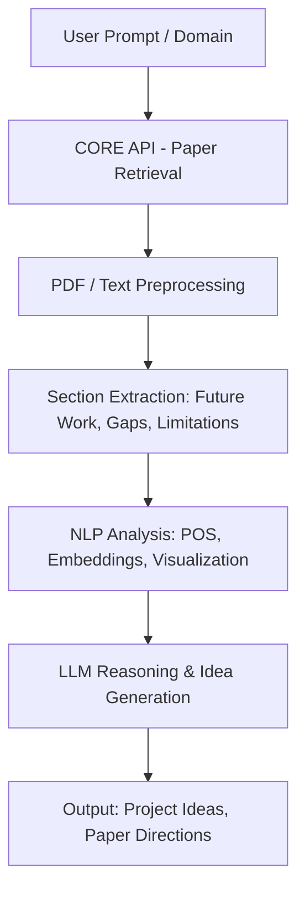

# Gen AI System for Identifying Research Gaps and Future Directions in Scientific Literature

This project can ingest open-access research papers, extracts *future work* and *research gaps*, and leverage LLMs to generate **project ideas, research directions, and paper suggestions**.  

---

## Features

- **Automated Paper Retrieval**  
  Uses [CORE API](https://core.ac.uk/) to fetch research papers across domains (AI, healthcare, sustainability, etc.).

- **Literature Section Extraction**  
  Identifies critical sections like *Future Work*, *Limitations*, and *Research Gaps*.

- **Preprocessing**  
  Text extraction, cleaning, tokenization, lemmatization, POS tagging, embeddings, and visualization.

- **Suggestions for further research**  
  Generates **new project ideas and research questions** from identified gaps using multiple specialized agents.
  
---

## Architecture

